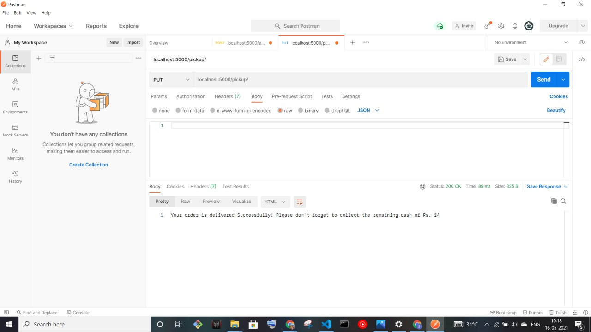
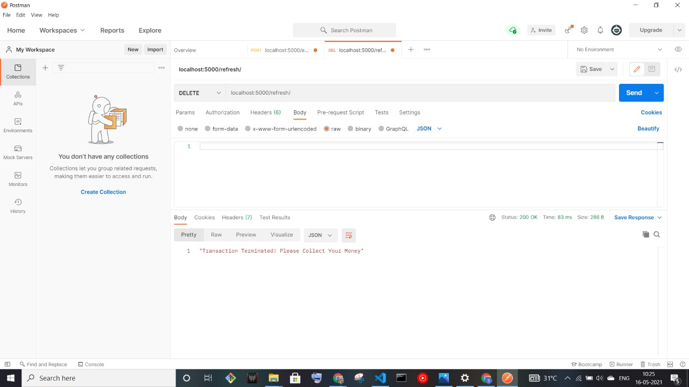

# 🌐 FINAL VENDING

An API to perform vending machine operations.

---

## :fire: How To Run

- Open terminal and navigate to `finalvending/server`
- Run `npm i`
- Run `npm run server`
- Open **Postman Tool** and verify all the endpoints on `localhost:5000/ATTRIBUTE`

## :fire: ATTRIBUTE

- `/entermoney` - End point for entering coins.
- `/selectdrinks` - End point for selecting drinks and checking whether the requested drinks are available or not.
- `/pickup` - End point for calculating bill.
- `/addmoney` - End point for entering extra money to complete the transaction.
- `/refresh` - End point for resetting the transaction by terminating it.

## :fire: Features

- Different types of coin inputs.
- Checks availability of stocks.
- Gives requested product and remaining change(if applicable).
- Reset option available for vending machine supplier.

---

## :bulb: Built Using

- **NODEJS**
- **EXPRESSJS**
- **MONGODB-ATLAS**
- **POSTMAN API TESTING TOOL**

---

## :computer: Screenshots
- **Enter Money**

 
- **Select Drinks**

 
- **Billing Stage**

 
- **Response When Insufficient Amount Is Paid**

 
 - **Adding Extra Money Which Was Asked**

 
- **Reset Option To Termninate Ongoing Transaction**

---

## :man: Project Created & Maintained By

  **Shashank Verma**

